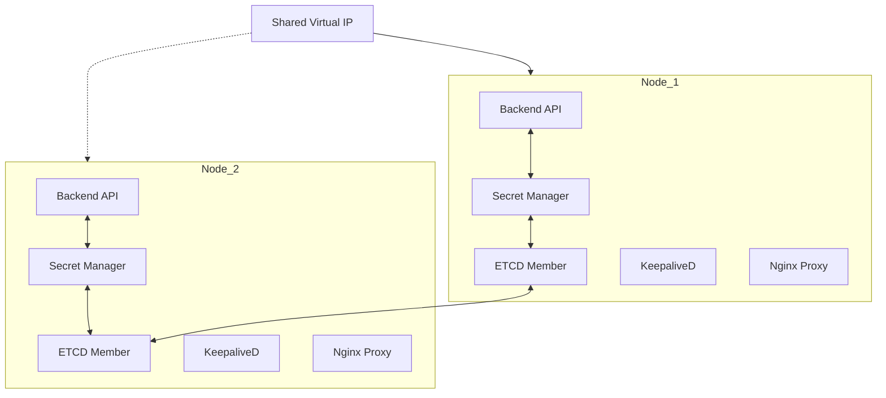

# Cluster Implementation Plan - Core Docker

This plan outlines the evolution of the single-node Docker management app into a multi-node, highly available cluster.

## 1. System Architecture

## 2. Component breakdown

### 2.1 Cluster & ETCD Knowledge Base
- **ETCD Implementation:** Each node runs an ETCD container. ETCD completely replaces SQLite for all cluster-wide configuration and container states. This ensures that if the current Master node fails, any other node can become the new Master and access the exact same state from its local ETCD member.
- **System Backups:** All critical system volumes (including ETCD data directories and Nginx configuration) will be marked as `backup` type. This ensures that the Restic scheduled job automatically includes the entire system's state in its backups.
- **Master Node Identification:** The app will dynamically identify the "Master Node" by querying the ETCD cluster status. The node co-located with the current ETCD leader (identified via `etcdctl endpoint status` or the Maintenance API) will be responsible for hosting the cluster-wide configuration UI and managing the Shared IP pool.

### 2.2 Shared IP (KeepaliveD)
- **Pool Management:** A configurable pool of IPs managed on the Master Node.
- **Health Checks:** KeepaliveD containers monitor the availability of nodes and shift the Virtual IP (VIP) to a healthy node if the current one fails.

### 2.3 Container Groups & Networking
- **Groups:** Replace the current per-container network selection with "Container Groups".
- **Internal Network:** All containers within a group automatically share an internal Docker network.

### 2.4 High Availability (HA)
- **HA Toggle:** Configuration on a per-container basis.
- **Server Selection:** Select which nodes a specific container is allowed to run on.
- **Failover:** If a node goes down, the orchestrator (reconciler) ensures the container starts on another selected node.

### 2.5 Backups & Sync (Restic)
- **Volume Types:**
    - `backup`: Included in daily Restic jobs. All critical system data (ETCD, Configs) defaults to this type.
    - `non-backup`: Ignored by backup jobs (e.g., media).
- **Scheduling:** A system-wide scheduler runs Restic containers daily.
- **Pause Capability:** The status page/schedule overview will include a toggle to **pause/resume** any individual scheduled task (Backups, Sync, Certbot).
- **Sync:** A synchronization tool (e.g., Rclone or Syncthing) syncs backup volumes across all HA-capable nodes for that container. This runs on a separate, configurable schedule (e.g., every 10 minutes) independent of the daily backup.

### 2.7 Advanced Container Configuration
- **Advanced Options:** Support for new container-level settings:
    - `tmpfs`: Mount volatile memory-based filesystems.
    - `stop_grace_period`: Configurable timeout for graceful container shutdown.
    - `shm_size`: Shared memory size configuration (e.g., for databases or specialized apps).
    - `devices`: Pass-through host devices (e.g., GPUs or USB devices) to the container.
    - `privileged`: Option to run the container in privileged mode for full host access.

### 2.8 Secret Management
- **High Availability Secrets:** The Secret Manager will run on **every node** as a lightweight sidecar or service.
- **Persistence:** All Secret Managers in the cluster will share the same ETCD backend. Since ETCD is distributed and synchronized, the secret store is available on any node.
- **Failover:** If the current Master node fails, the new Master node already has its own local Secret Manager connected to the ETCD cluster, ensuring uninterrupted access to all certificates and credentials.
- **Architecture:** The Secret Manager acts as an encryption layer on top of ETCD. It stores encrypted secrets *within* ETCD but handles the encryption/decryption keys separately, ensuring secrets are never readable in plain text even if the ETCD store is accessed directly.

### 2.6 SSL Management (Certbot + Cloudflare)
- **ACME Automation:** Certbot container runs daily.
- **Cloudflare Integration:** Uses Cloudflare API credentials (stored in cluster config) for DNS-01 challenges.
- **Auto-Config:** Certificates are automatically mapped to the Nginx proxy based on container configuration.

## 3. Implementation Steps

1. **Phase 1: Database Migration:** Replace SQLite logic in [`backend/services/db.js`](backend/services/db.js:1) with an ETCD client. All container configurations, cluster settings, and status information will be stored as keys in ETCD.
2. **Phase 2: Cluster Management:** Implement Node discovery, ETCD cluster orchestration, and Secret Manager deployment.
3. **Phase 3: Networking Refactor:** Transition from manual networks to Group-based networking in [`backend/services/reconciler.js`](backend/services/reconciler.js:1).
4. **Phase 4: Scheduler & Tasks:** Implement the status page and background task runner for Restic and Certbot.
5. **Phase 5: UI Updates:** Create the Master Node settings page and update the Container creation flow to include Grouping, HA selection, and Advanced Options (tmpfs, devices, privileged mode, etc.).

## 4. Questions & Refinements
- Would you like the ETCD cluster to be managed automatically by the app, or will the user provide the ETCD endpoints? (Currently planning automatic management via containers).
- Should the 'sync' tool run immediately after a backup, or as a separate independent schedule?
