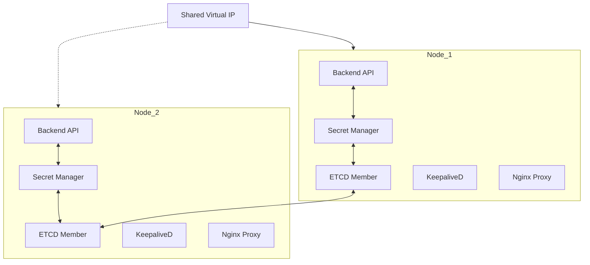

# Cluster Implementation Plan - Core Docker

This plan outlines the evolution of the single-node Docker management app into a multi-node, highly available cluster.

## 1. System Architecture

## 2. Component breakdown

### 2.1 Cluster & ETCD Knowledge Base
- **ETCD Implementation:** Each node runs an ETCD container. ETCD completely replaces SQLite for all cluster-wide configuration and container states. This ensures that if the current Master node fails, any other node can become the new Master and access the exact same state from its local ETCD member.
- **ETCD Lifecycle & Management:**
    - **Bootstrap:** When the first node is initialized, the Backend API spins up a standalone ETCD container. As new nodes are manually registered via the UI, the Backend API triggers a `member add` command on the existing cluster and provides the new node with the `initial-cluster` configuration string.
    - **Configuration:** ETCD is configured with `--initial-cluster-state new` for the first node and `existing` for subsequent nodes. Peer communication occurs on a dedicated port (default 2380) over the Backhaul Network.
    - **Health Monitoring:** The Backend API periodically monitors ETCD health via `/health` endpoints. If a local ETCD instance fails, the Reconciler attempts a container restart.
    - **Quorum Awareness:** The UI will display a warning if the cluster size falls below quorum (e.g., 1 node up in a 3-node cluster).
- **Backhaul Network:** A dedicated backhaul network (configurable via interface or IP range) will be used for all internal cluster traffic. This includes ETCD peer-to-peer communication, volume synchronization, and inter-node API heartbeats, ensuring isolation from public-facing application traffic.
- **System Backups:** All critical system volumes (including ETCD data directories and Nginx configuration) will be marked as `backup` type. This ensures that the Restic scheduled job automatically includes the entire system's state in its backups.
- **Master Node Identification:** The app will dynamically identify the "Master Node" by querying the ETCD cluster status. The node co-located with the current ETCD leader (identified via `etcdctl endpoint status` or the Maintenance API) will be responsible for hosting the cluster-wide configuration UI and managing the Shared IP pool.
- **Manual Node Registration:** Cluster membership is managed through manual configuration. Users will provide the IP addresses of the participating nodes in the configuration panel, eliminating the need for complex automatic discovery protocols.

### 2.2 Shared IP & Node IPs (KeepaliveD)
- **Per-Node IPs:** Each server is assigned its own dedicated IP address for running its unique non-HA applications.
- **Shared IP Pool Management:** A configurable pool of Shared Virtual IPs (VIPs) managed on the Master Node.
- **Health Checks & HA Failover:** KeepaliveD containers monitor node health. If a node hosting an HA container fails, the Shared IP (VIP) associated with that container's group automatically shifts to a healthy "backup" node in the cluster.
- **Nginx Proxy Automatic Re-binding:** Upon a VIP failover, the system's orchestrator (or a KeepaliveD notification script) automatically ensures that the Nginx proxy on the *new* master node binds to the transferred Shared IP. This allows the highly available containers to remain accessible on the same IP address with minimal downtime.

### 2.3 Container Groups & Networking
- **Groups:** Replace the current per-container network selection with "Container Groups".
- **Node Locality:** A container group is pinned to a single node at any given time. All containers within a group must run on the same server to share the local Docker internal network.
- **Failover Behavior:** If a group is marked as High Availability, the *entire group* fails over together to a new node to maintain internal connectivity.
- **Internal Network:** All containers within a group automatically share an internal Docker network created locally on the host node.

### 2.4 High Availability (HA) & Failover Orchestration
- **HA Toggle:** Configuration on a per-container basis.
- **Server Selection:** Select which nodes a specific container is allowed to run on.
- **Node Heartbeats (ETCD Leases):** Each node's Backend API maintains a "Liveness Lease" in ETCD with a short TTL (e.g., 5-10 seconds).
- **Failover Detection (ETCD Watches):** All nodes watch for lease expiration events. When a node's lease expires, it is marked as "Down" in the cluster state.
- **Failover Execution:** The current Master node (ETCD Leader) receives the "Down" event and immediately:
    1. Identifies all HA containers that were scheduled on the failed node.
    2. Consults the "Server Selection" list for each container.
    3. Re-schedules those containers onto the next available healthy node.
    4. Triggers the Nginx re-binding to the Shared IP on the new host nodes.

### 2.5 Backups & Sync (Restic)
- **Volume Types:**
    - `backup`: Included in daily Restic jobs. All critical system data (ETCD, Configs) defaults to this type.
    - `non-backup`: Ignored by backup jobs (e.g., media).
- **Scheduling:** A system-wide scheduler runs Restic containers daily.
- **Pause Capability:** The status page/schedule overview will include a toggle to **pause/resume** any individual scheduled task (Backups, Sync, Certbot).
- **Sync:** A synchronization tool (e.g., Rclone or Syncthing) syncs backup volumes across all HA-capable nodes for that container. This runs on a separate, configurable schedule (e.g., every 10 minutes) independent of the daily backup.

### 2.7 Advanced Container Configuration
- **Advanced Options:** Support for new container-level settings:
    - `tmpfs`: Mount volatile memory-based filesystems.
    - `stop_grace_period`: Configurable timeout for graceful container shutdown.
    - `shm_size`: Shared memory size configuration (e.g., for databases or specialized apps).
    - `devices`: Pass-through host devices (e.g., GPUs or USB devices) to the container.
    - `privileged`: Option to run the container in privileged mode for full host access.

### 2.8 Secret Management
- **Centralized Vault:** Deploy a lightweight secret manager (e.g., Infisical or a specialized ETCD-backed vault) as the **sole storage** for all sensitive data. This includes:
    - **SSL Certificates and Private Keys.**
    - **Cloudflare API Credentials.**
    - **Restic Backup Repository Passwords and Endpoints.**
    - **Container Environment Secrets.**
- **High Availability Secrets:** The Secret Manager will run as a lightweight container. The orchestrator (reconciler) will ensure it is automatically spun up on the Master Node (or any node where it is needed).
- **Persistence:** All Secret Managers in the cluster share the same ETCD backend. Since ETCD is distributed and synchronized, the secret store is available on any node.
- **Failover:** If the current Master node fails, the new Master node already has its own local Secret Manager connected to the ETCD cluster, ensuring uninterrupted access to all certificates and credentials.
- **Architecture:** The Secret Manager acts as an encryption layer on top of ETCD. It stores encrypted secrets *within* ETCD but handles the encryption/decryption keys separately, ensuring secrets are never readable in plain text even if the ETCD store is accessed directly.

### 2.6 SSL Management (Certbot + Cloudflare)
- **ACME Automation:** Certbot container runs daily.
- **Cloudflare Integration:** Uses Cloudflare API credentials (retrieved from the **Secret Manager**) for DNS-01 challenges.
- **Certificate Storage:** All generated SSL certificates and private keys are stored exclusively in the **Secret Manager**.
- **Auto-Config:** Certificates are retrieved from the Secret Manager and automatically mapped to the Nginx proxy based on container configuration.

## 3. Implementation Steps

1. **Phase 1: Database Migration:** Replace SQLite logic in [`backend/services/db.js`](backend/services/db.js:1) with an ETCD client. All container configurations, cluster settings, and status information will be stored as keys in ETCD.
2. **Phase 2: Cluster Management:** Implement **manual Node registration** (IP entry), ETCD cluster orchestration, and Secret Manager deployment.
3. **Phase 3: Networking Refactor:** Transition from manual networks to Group-based networking in [`backend/services/reconciler.js`](backend/services/reconciler.js:1).
4. **Phase 4: Scheduler & Tasks:** Implement the status page and background task runner for Restic and Certbot.
5. **Phase 5: UI Updates:** Create the Master Node settings page and update the Container creation flow to include Grouping, HA selection, and Advanced Options (tmpfs, devices, privileged mode, etc.).

## 4. Design Decisions (Confirmed)
- **ETCD Management:** The application will automatically manage the ETCD containers on each node once the node IPs are manually registered.
- **Sync Schedule:** The volume synchronization tool (Rclone/Syncthing) runs on its own independent, high-frequency schedule (e.g., every 10 minutes) separate from the daily Restic backups.
