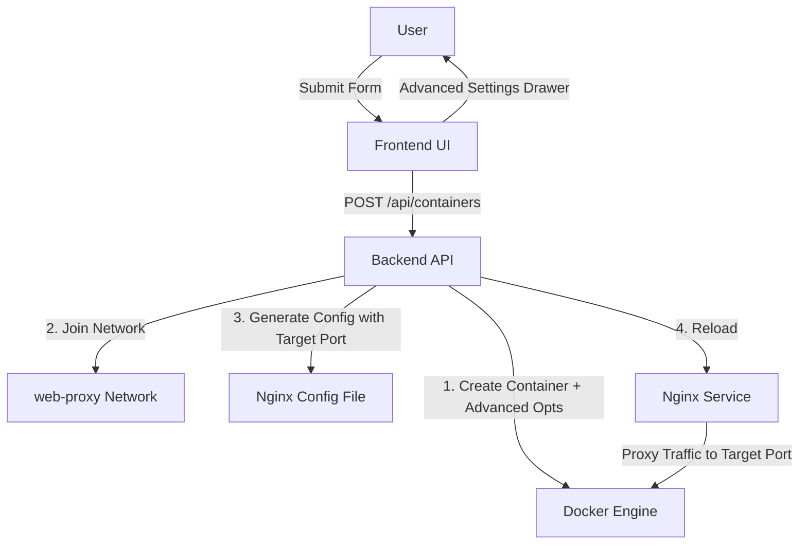

# Container Management System Plan

This plan outlines the implementation of a container management system with a baseline Nginx reverse proxy, dynamic URI configuration, and advanced container settings.

## Architecture Overview

The system will consist of:
1.  **Nginx Service**: Acts as the entry point for all managed containers.
2.  **Shared Network**: A Docker network (`web-proxy`) that managed containers will join to be reachable by Nginx.
3.  **Backend API**: Node.js/Express service that:
    -   Interacts with Docker via `dockerode`.
    -   Manages Nginx configuration files.
    -   Triggers Nginx reloads.
4.  **Frontend Dashboard**: Next.js UI to create containers with basic and advanced settings.

## Proposed Workflow

## Component Details

### 1. Nginx Setup
Nginx will be added to [`docker-compose.yml`](docker-compose.yml) with a volume mount for its configuration.
-   `./nginx/conf.d:/etc/nginx/conf.d`: To allow the backend to write new server blocks.
-   Shared network: `web-proxy`.

### 2. Advanced Container Settings
The system will support the following advanced configurations during creation:
-   **Environment Variables**: Key-value pairs.
-   **Volume Mounts**: Mapping host directories or volumes to container paths.
-   **Port Mapping with IP Binding**: Map host ports to container ports, with the ability to bind to a specific host IP.
-   **Proxy Port Configuration**: Specify which internal container port the reverse proxy should target (e.g., if a container has multiple ports, proxy only to `8080`).
-   **Restart Policies**: `no`, `always`, `unless-stopped`, `on-failure`.
-   **Resource Limits**: CPU and Memory constraints.

### 3. Backend Logic
-   **Creation Route**: `POST /api/containers` will accept a comprehensive configuration object.
-   **Proxy Logic**: If a URI is provided, the backend will generate a `.conf` file using the specified container port for the `proxy_pass` directive and reload Nginx.

### 4. Frontend UI
-   **Main Creation Form**: Basic fields like Image and Name.
-   **Advanced Settings Drawer**: A sliding drawer containing sections for Environment, Volumes, Networking (IP/Port bindings), and Resources.
-   **Reverse Proxy Section**: Toggle for proxying, URI input field, and a "Container Port" field to specify the proxy target.

## Next Steps

1.  **Modify `docker-compose.yml`**: Add the `nginx` service and the `web-proxy` network.
2.  **Implement Config Service**: Create a utility in the backend to manage Nginx configuration templates with dynamic port support.
3.  **Update Routes**: Add the advanced container creation logic to [`backend/routes/containers.js`](backend/routes/containers.js).
4.  **Build Frontend**: Develop the creation form with the advanced settings drawer and reverse proxy port targeting.
