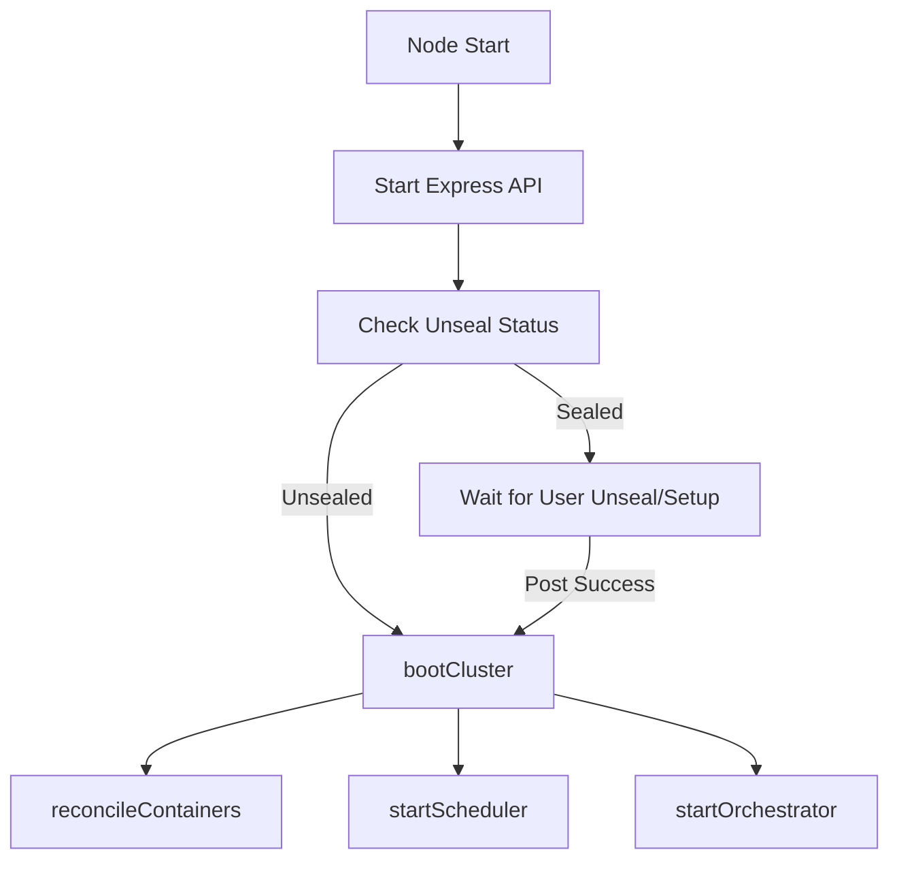

# Full-Stack Encryption & Secret Injection Plan

This plan outlines the implementation of transparent data-at-rest encryption for ETCD, delayed cluster bootstrapping until unsealed, and a secure secret injection mechanism for containers.

## 1. ETCD Prefix-Based Encryption ([`backend/services/db.js`](backend/services/db.js))

### Objectives
- Implement a transparent encryption/decryption layer within the ETCD service.
- Use an in-memory Data Encryption Key (DEK).
- Ensure critical system paths remain in plaintext for bootstrapping.

### Architecture
We will wrap the `etcd.put`, `etcd.get`, and `etcd.getAll` calls to intercept values based on their keys.

**Plaintext Prefixes (EXCLUDED from encryption):**
- `system/*` (Master hash, Encrypted DEK, etc.)
- `skydns/*` (Internal DNS routing)
- `nodes/*` (Node registration and health status)

**Encrypted Prefixes (AUTOMATICALLY encrypted/decrypted):**
- `core/*` (Everything under the core namespace)
  - `core/containers/*` (Migrated from `containers/*`)
  - `core/secrets/*` (Migrated from `secrets/*`)
  - `core/tasks/*`
  - `core/settings/*`

### Data Migration & Compatibility
- **Schema Change:** Moving `containers/*` and `secrets/*` under `core/` represents a breaking change in the ETCD schema.
- **Migration Policy:** Existing data in the old locations will not be automatically migrated. As the system is currently in a testing phase, the ETCD store will be wiped during the deployment of this new schema.
- **Graceful Transition:** Decryption failure logic will remain to help handle any legacy plaintext values during the transition.

### Implementation Details
- **Encryption Algorithm:** AES-256-CBC (standard in the project).
- **DEK Management:** The DEK is retrieved from [`backend/services/secrets.js`](backend/services/secrets.js) once the node is unsealed.
- **Logic:**
  - `put(key, value)`: If key matches encrypted prefix, encrypt value before sending to ETCD.
  - `get(key)`: If key matches encrypted prefix, decrypt value after fetching from ETCD.
  - `getAll().prefix(p)`: If prefix matches encrypted list, decrypt all returned values.

### Decryption Failure Handling
To ensure system stability during transitions (e.g., first enabling encryption) or DEK issues:
- **Graceful Degradation:** If a value under an encrypted prefix fails to decrypt (e.g., malformed ciphertext, wrong IV format, or `crypto` throws an error), the system should **fallback to returning the raw string**.
- **Logging:** All decryption failures must be logged with `console.error` (omitting the sensitive data itself) to allow for debugging.
- **Consistency:** This allows the system to continue functioning if it encounters legacy plaintext data that hasn't been migrated yet.

---

## 2. Delayed Cluster Boot ([`backend/index.js`](backend/index.js))

### Objectives
- Allow the API to start (so the Unseal UI can function) but prevent cluster logic from running until unsealed.
- Trigger reconciliation and scheduling immediately upon successful unseal.

### Implementation Details
- Remove immediate calls to `reconcileContainers()`, `startScheduler()`, and `startOrchestrator()` from the `app.listen` callback.
- Create a `bootCluster()` function that encapsulates these calls.
- Modify the `/system/unseal` and `/system/setup` endpoints to call `bootCluster()` after a successful operation.
- Ensure `bootCluster()` is idempotent (only runs once per node start).

---

## 3. Secret Injection into Containers

### Secret Management ([`frontend/components/SecretsTab.js`](frontend/components/SecretsTab.js))
- User-created secrets (content/values) are managed entirely within the Secrets tab.
- This UI allows creating, editing, and deleting keys under the `core/secrets/*` prefix.

### UI Changes ([`frontend/components/CreateContainer.js`](frontend/components/CreateContainer.js))
- Update the Environment Variables section.
- Add a "Is Secret?" toggle/checkbox for each environment variable row.
- If enabled, the "Value" input becomes a `<select>` dropdown populated from `/api/secrets/keys`.
- **Filtering:** The UI must explicitly filter the list of keys to only include those starting with the `core/secrets/` prefix (user-created manual secrets). It must exclude any system secrets (e.g., `system/master_hash` or `system/encrypted_dek`) from the dropdown.
- **Selection Only:** The Create Container UI only allows *selecting* an existing secret key; it does not allow viewing or editing the secret's content.

### Config Format
- Store environment variables as `VAR_NAME={{SECRET:secret_key}}` in the container configuration within ETCD.

### Backend Logic ([`backend/services/reconciler.js`](backend/services/reconciler.js))
- In the `reconcileContainers` loop, before calling `docker.createContainer`:
  - Scan the `Env` array.
  - For any value matching the regex `/^\{\{SECRET:(.+)\}\}$|/`, extract the `secret_key`.
  - Fetch the plaintext secret using `getSecret(secret_key)` from `secrets.js`.
  - Replace the placeholder with the actual value in the Docker `Env` list.

---

## 4. Master Password & DEK Rotation ([`backend/services/secrets.js`](backend/services/secrets.js))

### Master Password Change
1. API receives `oldPassword` and `newPassword`.
2. Verify `oldPassword` against stored hash.
3. Generate new salt, hash `newPassword`.
4. Re-encrypt the **existing** `inMemoryDEK` using the `newPassword` and the new salt.
5. Save new hash and new encrypted DEK to ETCD atomically.

### DEK Rotation (Force Rotation)
This is a heavy operation that requires re-encrypting all user data.
1. **Lock Cluster:** Prevent any new writes to `core/*`.
2. **Fetch All:** Read all keys under the `core/*` prefix.
3. **Decrypt:** Use the **old** DEK to get plaintext.
4. **Generate New DEK:** Create a fresh 32-byte key.
5. **Encrypt:** Use the **new** DEK to encrypt the plaintext data.
6. **Save:** Update all keys in ETCD.
7. **Re-encrypt DEK:** Encrypt the new DEK with the current Master Password hash and save to `system/encrypted_dek`.
8. **Unlock Cluster.**

---

## Todo List for Implementation

### Phase 1: Core Encryption Layer
- [ ] Implement `encryptValue` and `decryptValue` helpers in `db.js`.
- [ ] Create the prefix-based middleware/wrapper in `db.js`.
- [ ] Update `secrets.js` to expose the `inMemoryDEK`.

### Phase 2: Boot Logic
- [ ] Refactor `index.js` to wrap cluster services in `bootCluster()`.
- [ ] Update unseal/setup routes to trigger `bootCluster()`.

### Phase 3: Secret Injection
- [ ] Modify `CreateContainer.js` to handle secret selection.
- [ ] Update `reconciler.js` to resolve `{{SECRET:...}}` placeholders.

### Phase 4: Maintenance APIs
- [ ] Implement `changeMasterPassword` in `secrets.js`.
- [ ] Implement `rotateDEK` transaction logic in `secrets.js`.
- [ ] Add UI controls in `SettingsTab.js` for rotation and password changes.
